# Unity Editor UI

## Objectives

- Label the default windows of the Unity Editor.
- Explain the relationship between the Unity windows.
- Assess which Unity window contains a feature necessary to perform a particular task.

## Introduction

The Unity Editor interface is organized into windows what can be rearranged to suit your layout preference. The image of the Editor below displays the most common windows in their default positions:

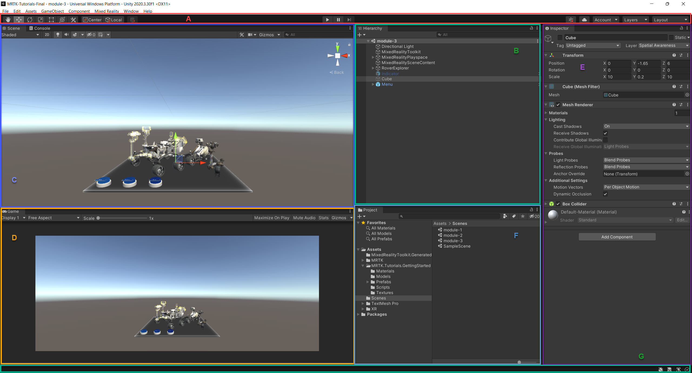

- A, The Toolbar
- B, The Hierarchy Window
- C, The Scene view
- D, The Game view
- E, The Inspector Window
- F, The Project Window
- G, The Status Bar

*Note*: The toolbar and status bar are not windows, rather, these two are common default features of the Unity Editor which cannot be rearranged.

### The Toolbar

The **Toolbar** provides access to the most essential working features. You can find the toolbar at the top of the Unity Editor. The Toolbar consists of several groups of controls, each related to different parts of the Editor. 

*Transform Tools*

Use the **Transform Tools** in the Scene view to manipulate the scene. The first tool in the toolbar, the Hand Tool, allows you to pan around the Scene. The Move, Rotate, Scale, Rect Transform and Transform tools (displayed in order) allow you to edit individual objects. Selected objects also display a Gizmo in the Scene view if you have one of the four Transform tools selected.

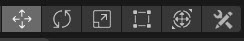

*Transform Gizmos*

Toggling the Transform Gizmo affects the the Scene view.

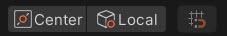

*Play, Pause, and Step*

Use the Play, Pause, and Step buttons in the Game view.

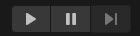

*Unity Collaborate*

Launch Unity Collaborate from the Collab drop-down menu.

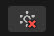

*Cloud*

Click the Cloud button to open the Unity Services window.

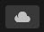

*Unity Account*

You can access your Unity Account from the Account drop-down menu.

*Layers*

You can control which objects appear in Scene view from the Layers drop-down menu.

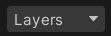

*Layout*

You can change the arrangement of your views and then save the new layout or load an existing from the Layout drop-down menu.

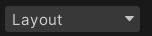

### The Hierarchy Window

The Hierarchy window is a hierarchical text representation of every object (or **GameObject**) in the Scene. Each item in the Scene has an entry in the hierarchy, so the two windows are inherently linked. The hierarchy reveals the structure of how GameObjects attach to each another. You can use the Hierarchy window to sort and group the GameObjects you use in a Scene. By default, the Hierarchy window lists GameObjects in the order they’re created. You can drag the selected GameObject up or down in the Scene to change the order of the GameObjects.  When you add or remove GameObjects in the Scene view, you also add or remove them from the Hierarchy window. The Hierarchy window can also contain other Scenes, with each Scene containing their own GameObjects.

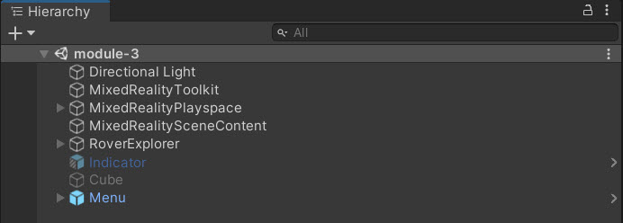

*Parenting*

Unity uses the concept of parent-child hierarchies, or parenting, to group GameObjects. An object can contain other GameObjects that inherit its properties. You can link GameObjects together to help move, scale, or transform a collection of GameObjects. When you move the top-level object, or parent GameObject, you also move all child GameObjects.

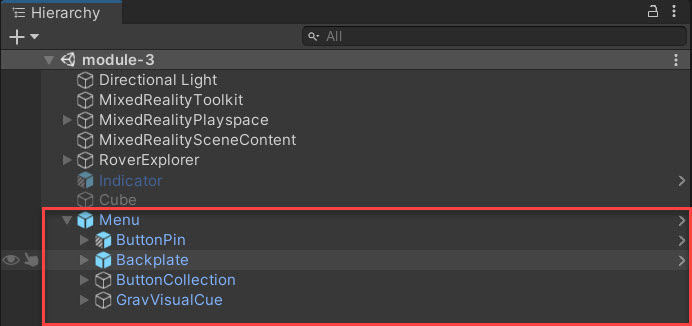

You can also create nested parent-child GameObjects. All nested objects are still descendants of the original parent GameObject, or root GameObject. Child GameObjects inherit the movement and rotation of the parent GameObject.

*GameObject Visibility*

GameObjects can be hidden from view in the Scene view without changing their in-application visibility. These controls are useful for working with large or complex Scenes where it's difficult to view and select specific GameObjects. To hide or show a GameObject, click the Scene visibility icon.

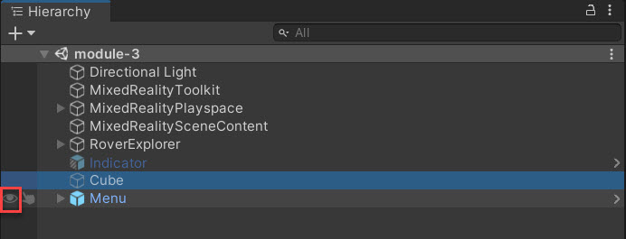

### The Scene view

The Scene view allows you to visually navigate and edit your Scene. The Scene view can show a 3D or 2D perspective, depending on the type of Project you are working on. You can use the Scene view to select and position scenery, characters, Cameras, lights, and all other types of GameObjects.

**Scene Navigation**

The Scene view has a set of navigation controls to help you move around quickly and efficiently:

- The Scene Gizmo
- The Move, Orbit and Zoom tools
- The Center tool

*Scene Gizmo*

The Scene Gizmo appears in the upper-right corner of the Scene view. This displays the Scene view Camera’s current orientation, and allows you to quickly modify the viewing angle and projection mode.

The Scene Gizmo has a conical arm on each side of the cube. The arms at the forefront are labelled X, Y and Z. Click on any of the conical axis arms to snap the Scene view Camera to the axis it represents (example: top view, left view and front view). You can also right-click the cube to bring up a menu with a list of viewing angles. To return to the default viewing angle, right-click the Scene Gizmo and click Free.

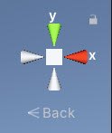

You can also toggle Perspective on and off. This changes the projection mode of the Scene view between Perspective and Orthographic (sometimes called “isometric”). To do this, click the cube in the centre of the Scene Gizmo, or the text below it. The Orthographic view has no perspective, and is useful in combination with clicking one of the conical axis arms to get a front, top or side elevation.

If your Scene view is in an awkward viewpoint (upside-down, or just an angle you find confusing), Shift-click the cube at the centre of the Scene Gizmo to get back to a Perspective view with an angle that is looking at the Scene from the side and slightly from above.

Click on the padlock on the top right of the Scene Gizmo to enable or disable rotation of the Scene. Once Scene rotation is disabled, right-clicking the mouse pans the view instead of rotating it. This is the same as the Hand tool.

*Note*: In 2D Mode, the Scene Gizmo does not appear because the only option is to have the view looking perpendicularly at the X,Y plane.

*Move, Orbit, and Zoom*

The Hand tool within the Toolbar has three interchangeable modes: move, orbit, and zoom. Move mode, represented by a hand, enables you to move the Camera around by clicking and dragging.

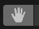

Orbit mode, represented by an eye icon, enables you to orbit the Camera around the current pivot point by pressing ALT/Option + left-click and drag. 

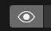

Zoom mode, represented by a magnifying glass with a plus icon, enables you to zoom the Scene view by pressing ALT/Option + right-click and drag. 

For each mode, you can hold down Shift to increase the rate of movement and zooming.

*Center Tool*

For better visibility of an object, the Scene view can be centred on a GameObject. To do so, select the GameObject in the Hierarchy, move the mouse over the Scene view, and press F. You can further lock the view to the GameObject even when the GameObject is moving with Shift+F.

### The Game view

The Game view simulates what your final rendered game will look like through your Scene Cameras. When you click the Play button in the Toolbar, you enter Play mode and the simulation begins. While in Play mode, any changes you make are temporary, and are reset when you exit Play mode. One or more Camera GameObjects are needed to control what the player sees when they are using your application.

### The Inspector Window

The Inspector Window allows you to view and edit all the properties of the currently selected GameObject. Because different types of GameObjects have different sets of properties, the layout and contents of the Inspector window change each time you select a different GameObject. Components within the hierarchy can also be reordered. When you have two or more items selected, you can edit all of the properties they have in common in an Inspector window. Unity copies the values you supply to all the selected items. The Inspector window displays a count of the number of selected items.

### The Project Window

The Project window displays your library of Assets that are available to use in your Project. When you import Assets into your Project, they appear here. The Project window is the main way you can navigate and find Assets and other Project files in your application.

The left panel of the browser shows the folder structure (A) of the Project as a hierarchical list. When you select a folder from the list, Unity shows its contents in the pane to the right.

Individual Assets (B) are shown in the right hand panel as icons that indicate their type (for example, script, material, sub-folder). To resize the icons, use the slider at the bottom of the panel; they will be replaced by a hierarchical list view if the slider is moved to the extreme left. The space to the left of the slider shows the currently selected item, including a full path to the item if a search is being performed.

Above the Project structure list is a Favorites section (C) where you can keep frequently-used items for easy access. You can drag items from the Project structure list to the Favorites and also save search queries there.

The Project window also contains a toolbar with additional actions for creating Assets and sub-folders, searching the Project folders, and toggling the visibility of the packages in the Project window.

### The Status Bar

The status bar provides notifications about various Unity processes, and quick access to related tools and settings.

## Post-Lecture Quiz

[Quiz](https://ashy-plant-023e6671e.1.azurestaticapps.net/quiz/17)

## Review and Self Study

We've identified the following resources to provide additional context and learning for the content reviewed in this lesson. We encourage you to review the material below and explore additional related topics.

- [Unity's Interface](https://docs.unity3d.com/Manual/UsingTheEditor.html)
