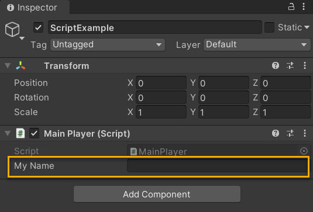
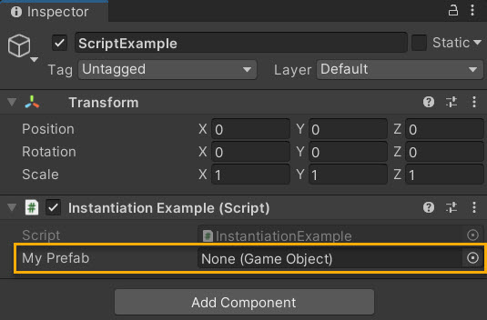

# Unity Scripting

## Objectives

- Explain the elements of a Unity script.
- Assess the issue for Null Reference Exceptions.
- Evaluate an appropriate class or classes for app logic.

## Introduction

Unity uses C# as its primary language, and although not always necessary to create an XR experience, it provides developers with the opportunity of modifying or altering objects, their behaviors and interactions and more. This is done through pieces of code called scripts.

The behavior of GameObjects is controlled by the Components that are attached to them. Although Unity’s built-in Components can be very versatile, you will soon find you need to go beyond what they can provide to implement your own features. Unity allows you to create your own Components using scripts. These allow you to trigger game events, modify Component properties over time and respond to user input in any way you like. Scripts are usually created within Unity directly. The code within a script is not activated until an instance of the script is attached to a GameObject as a component.

Visual Studio is the default selected IDE within Unity preferences. When a script is opened via the Editor, Unity launches Visual Studio. Unity also supports Visual Studio Code and JetBrains Rider.

### Anatomy of a Script File

The initial contents of the file will look something similar to this:

```csharp
using UnityEngine;
using System.Collections;

public class MainPlayer : MonoBehaviour {

    // Use this for initialization
    void Start () {
    
    }
    
    // Update is called once per frame
    void Update () {
    
    }
}
``````

A script makes its connection with the internal workings of Unity by implementing a class which derives from the built-in class called MonoBehaviour. You can think of a class as a kind of blueprint for creating a new Component type that can be attached to GameObjects. Each time you attach a script component to a GameObject, it creates a new instance of the object defined by the blueprint. The name of the class is taken from the name you supplied when the file was created. The class name and file name must be the same to enable the script component to be attached to a GameObject.

The main things to note, however, are the two functions defined inside the class. The **Update()** function is the place to put code that will handle the frame update for the GameObject. This might include movement, triggering actions and responding to user input, basically anything that needs to be handled over time during app play. To enable the Update function to do its work, it is often useful to be able to set up variables, read preferences and make connections with other GameObjects before any game action takes place. The **Start()** function is called by Unity before the app begins (i.e., before the Update function is called for the first time) and is an ideal place to do any initialization.

### Variables and the Inspector

When creating a script, you are essentially creating your own new type of component that can be attached to a GameObject just like any other component.

Just like other Components often have properties that are editable in the Inspector, you can allow values in your script to be edited from the Inspector, too.

For example, the code below enables you to set the value for `myName` directly in the Editor and output the log message within the Console.

```csharp
using UnityEngine;
using System.Collections;

public class MainPlayer : MonoBehaviour 
{
    public string myName;
    
    // Use this for initialization
    void Start () 
    {
        Debug.Log("My name is " + myName);
    }
}
```

Once attached to a GameObject, editable fields are created within the script properties and labelled by the variable name.



In C#, the simplest way to see a variable in the Inspector is to declare it as public. An alternative method is to use `SerializeField`. Conversely, you can use `HideInInspector` to prevent a public variable from being displayed in the Inspector.

Unity will actually let you change the value of a script’s variables while in Play mode. This is very useful for seeing the effects of changes directly without having to stop and restart. When you exit Play mode, the values of the variables will be reset to whatever they were before you pressed Play. This ensures that you are free to tweak your object’s settings without fear of doing any permanent damage.

### Instantiating Prefabs at run time

Prefabs come in handy when you want to instantiate complicated GameObjects or collections of GameObjects at run time. Compared with creating GameObjects from scratch using code, instantiating Prefabs using code has many advantages because you can:

- Instantiate a Prefab using one line of code. Creating equivalent GameObjects from scratch requires many more lines of code.
- Set up, test, and modify the Prefab quickly and easily using the Scene view, Hierarchy and Inspector.
- Change which Prefab is instantiated without changing the code.

To instantiate a Prefab at run time, your code needs a reference to that Prefab. You can make this reference by creating a public variable in your code to hold the Prefab reference. The public variable in your code appears as an assignable field in the Inspector. You can then assign the actual Prefab you want to use in the Inspector.

The script example below has a single public variable, `myPrefab`, that is a reference to a Prefab. It creates an instance of that Prefab in the `Start()` method.

```csharp
using UnityEngine;
public class InstantiationExample : MonoBehaviour 
{
    // Reference to the Prefab. Drag a Prefab into this field in the Inspector.
    public GameObject myPrefab;

    // This script will simply instantiate the Prefab when the game starts.
    void Start()
    {
        // Instantiate at position (0, 0, 0) and zero rotation.
        Instantiate(myPrefab, new Vector3(0, 0, 0), Quaternion.identity);
    }
}
```

In the Inspector, the Prefab assigned to `myPrefab` appears at runtime.



### Order of execution for event functions

Running a Unity script executes a number of event functions in a predetermined order:

### Event functions

A script in Unity is not like the traditional idea of a program where the code runs continuously in a loop until it completes its task. Instead, Unity passes control to a script intermittently by calling certain functions that are declared within it. Once a function has finished executing, control is passed back to Unity. These functions are known as **event functions** since they are activated by Unity in response to events that occur during app play. The following are some of the most common and important events.

*Regular Update Events*

These events make changes to position, state, and behavior of objects in an app before each frame is rendered. The `Update()` function is called before the frame is rendered and also before animations are calculated.

The physics engine also updates in discrete time steps in a similar way to the frame rendering. A separate event function called `FixedUpdate()` is called just before each physics update. Since the physics updates and frame updates do not occur with the same frequency, you will get more accurate results from physics code if you place it in the `FixedUpdate()` function rather than `Update()`.

It is also useful sometimes to be able to make additional changes at a point after the `Update` and `FixedUpdate` functions have been called for all objects in the scene and after all animations have been calculated. An example is where a camera should remain trained on a target object; the adjustment to the camera’s orientation must be made after the target object has moved.

*Initialization Events*

It is often useful to be able to call initialization code in advance of any updates that occur during app play. The `Start()` function is called before the first frame or physics update on an object. The `Awake()` function is called for each object in the scene at the time when the scene loads. Note that although the various objects’ `Start()` and `Awake()` functions are called in arbitrary order, all the Awakes will have finished before the first `Start()` is called. This means that code in a `Start()` function can make use of other initializations previously carried out in the `Awake()` phase.

*Physics Events*

The physics engine will report collisions against an object by calling event functions on that object’s script. The `OnCollisionEnter()`, `OnCollisionStay()` and `OnCollisionExit()` functions will be called as contact is made, held and broken. The corresponding `OnTriggerEnter()`, `OnTriggerStay()` and `OnTriggerExit()` functions will be called when the object’s collider is configured as a Trigger (i.e, a collider that detects when something enters it rather than reacting physically). These functions may be called several times in succession if more than one contact is detected during the physics update and so a parameter is passed to the function giving details of the collision (position, identity of the incoming object, etc).

### Coroutines

A **coroutine** allows you to spread tasks across several frames. In Unity, a coroutine is a method that can pause execution and return control to Unity but then continue where it left off on the following frame. In most situations, when you call a method, it runs to completion and then returns control to the calling method, plus any optional return values. This means that any action that takes place within a method must happen within a single frame update. In situations where you would like to use a method call to contain a procedural animation or a sequence of events over time, you can use a coroutine.

It’s best to use coroutines if you need to deal with long asynchronous operations, such as waiting for HTTP transfers, asset loads, or file I/O to complete.

### Null Reference Exceptions

A `NullReferenceException` happens when you try to access a reference variable that isn’t referencing any object. When you get a `NullReferenceException` in your code it means that you have forgotten to set a variable before using it. If a reference variable isn’t referencing an object, then it’ll be treated as null. The error message will look something like:

```csharp
NullReferenceException: Object reference not set to an instance of an object
  at Example.Start () [0x0000b] in /Unity/projects/nre/Assets/Example.cs:8 
```

This error message says that a `NullReferenceException` happened on line 8 of the script file `Example.cs`. Also, the message says that the exception happened inside the `Start()` function. This makes the Null Reference Exception easy to find and fix. 

In this example, the code is:

```csharp
using UnityEngine;
using System.Collections;

public class Example : MonoBehaviour {

    // Use this for initialization
    void Start () {
        __GameObject__ go = GameObject.Find("wibble");
        Debug.Log(go.name);
    }

}
```

The code looks for a GameObject called “wibble”. In this example there is no game object with that name, so the `Find()` function returns `null`. On the next line (line 9) we use the go variable and try and print out the name of the GameObject it references. Because we are accessing a GameObject that doesn’t exist, the run-time gives us a `NullReferenceException`.

Consider implementing a conditional statement within the script for null checks. In the code example, the script first checks whether the variable `go` is not `null`. If it is `null`, then a message displays.

```csharp
using UnityEngine;
using System.Collections;

public class Example : MonoBehaviour {

    void Start () {
        GameObject go = GameObject.Find("wibble");
        if (go) {
            Debug.Log(go.name);
        } else {
            Debug.Log("No game object called wibble found");
        }
    }

}
```

Another cause for `NullReferenceException` is if you use a variable that should be initialized in the Inspector and forget to do so. The variable will be `null`. In the following code example, the variable called `myLight` is a Light which should be set in the Inspector window. 

If this variable is not set, then it will default to `null`. Consider implementing a try/catch block within the script for such null checks. Attempting to change the color of the light in the `try` block causes a `NullReferenceException` which is picked up by the `catch` block. The `catch` block displays a message that alludes to the corrective action.

### Important Classes

Below is a list of the most commonly used and important built-in classes in Unity that you may want to use when scripting:

|Class  |Description  |
|---------|---------|
|`GameObject`     |   Represents the type of objects which can exist in a Scene.      |
|`MonoBehaviour`    |  The base class from which every Unity script derives, by default.       |
|`Object`     |  The base class for all objects that Unity can reference in the editor.       |
|`Transform`    |    Provides you with a variety of ways to work with a GameObject’s position, rotation and scale via script, as well as its hierarchical relationship to parent and child GameObjects.     |
|`Vectors`     |   Classes for expressing and manipulating 2D, 3D, and 4D points, lines and directions.      |
|`Quaternion`     |    A class which represents an absolute or relative rotation, and provides methods for creating and manipulating them.     |
|`ScriptableObject`     |   A data container that you can use to save large amounts of data.      |
|`Time` (and framerate management)     |   Allows you to measure and control time, and manage the framerate of your project.      |
|`Mathf`     |    A collection of common math functions, including trigonometric, logarithmic, and other functions commonly required in games and app development.     |
|`Random`    |   Provides you with easy ways of generating various commonly required types of random values.      |
|`Debug`    |   Allows you to visualize information in the Editor that may help you understand or investigate what is going on in your project while it is running.       |
|`Gizmos` and `Handles`     | Allows you to draw lines and shapes in the Scene view and Game view, as well as interactive handles and controls.        |

## Post-Lecture Quiz

[Quiz](https://ashy-plant-023e6671e.1.azurestaticapps.net/quiz/20)

## Review and Self Study

We've identified the following resources to provide additional context and learning for the content reviewed in this lesson. We encourage you to review the material below and explore additional related topics.

- [Unity Scripting Reference](https://docs.unity3d.com/ScriptReference/)
- [Beginner Scripting](https://learn.unity.com/course/beginner-scripting)
