# XR Implementation Example: AR in iOS

## Prerequisites

**Unity**

This example requires you to create an app in [Unity](https://unity.com/). If you don't already have Unity installed, visit [unity.com/download](https://unity.com/download) to download the Unity Hub. This activity can be completed with Unity version **2020.3.20f1** or newer.

**Visual Studio**

This example requires you to create code in [Visual Studio](https://visualstudio.microsoft.com/downloads/). Ensure that Visual Studio is downloaded and set as the default editor for Unity. If you're unfamiliar with the steps to set Visual Studio as the default editor, review [Set Your Default Script Editor](https://learn.unity.com/tutorial/set-your-default-script-editor-ide#612f3e91edbc2a1b4b4418ee). This activity can be completed with **Visual Studio 2019** or newer.

**Xcode**

This example produces an Xcode project, which allows for deployment into iOS and requires [Xcode](https://developer.apple.com/xcode/) to be installed. Xcode is Apple's development environment, and is only available for macOS.

### Project Setup

1. Create a new Unity Project using a **AR** template. 

    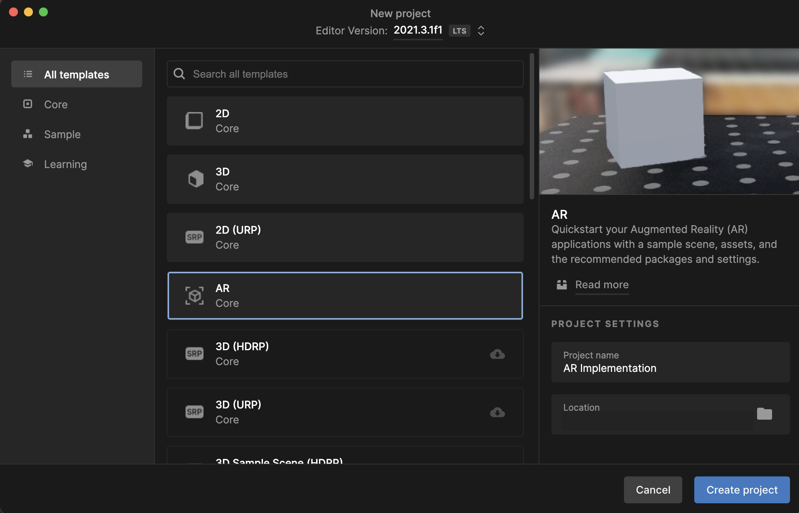

1. Set up the project to support ARKit as the plug-in provider, by navigating to **Edit > Project Settings > XR Plug-in Management** and checking ARKit under the iOS tab.

    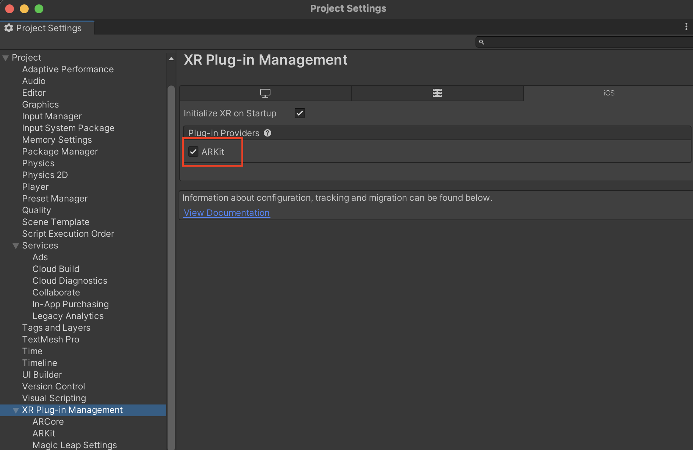

1. Provide a **Company Name** and **Product Name** for the app. To do so, navigate to **Edit > Project Settings > Player**.

1. Turn off **Override Default Bundle Identifier** and **Automatically Sign** check box under **Identification** in **Player Settings**, as we will manage these options before deployment in Xcode.

1. Change the **Target Device** to **iPhone only** and **Target minimum iOS Version** to 11.0 or higher. Enable the check box **Requires ARKit Support**.

1. Switch the deployment platform to iOS by navigating to **File > Build Settings**, selecting the iOS tab and clicking on **Switch Platform**.

1. In the **Project** window, create the following 5 folders inside the **Assets** folder:
    - Materials
    - Models
    - Prefabs
    - Scripts
    - Textures

    To create a new folder, right click into the **Assets** folder and select **Create > Folder**.

    

### Create the Placement Indicator

The placement indicator helps the user place a digital object in the real world by signaling where the object will be placed, and which orientation it will have. 

1. In the **Hierarchy** window, right click and select **Create Empty**. Name the object **PlacementIndicator**.

1. Right click on the PlacementIndicator object we just created and select **3D Object > Quad**. Name the object **Target**.

1. Right now, the target looks like a blank square. In order to change that we will import an *indicator* image to our **Textures** folder, which we will then use to create a material for the object. Import the [Target Image](../images/target.png) (Source: Flaticon) by downloading it and then dragging it into the **Textures** folder.

1. In the **Inspector Window** change the texture type to **Sprite (2D and UI)** and click on **Apply**.

1. Now we can create a **Material**. To create a new material, in the **Project** window, right click into the **Materials** folder and select **Create > Material**. Name it **Indicator**. 

1. In the **Inspector Window** change the **Shader** property to **Unlit > Transparent**. Under **Texture** click on Select and choose the Target Image.

    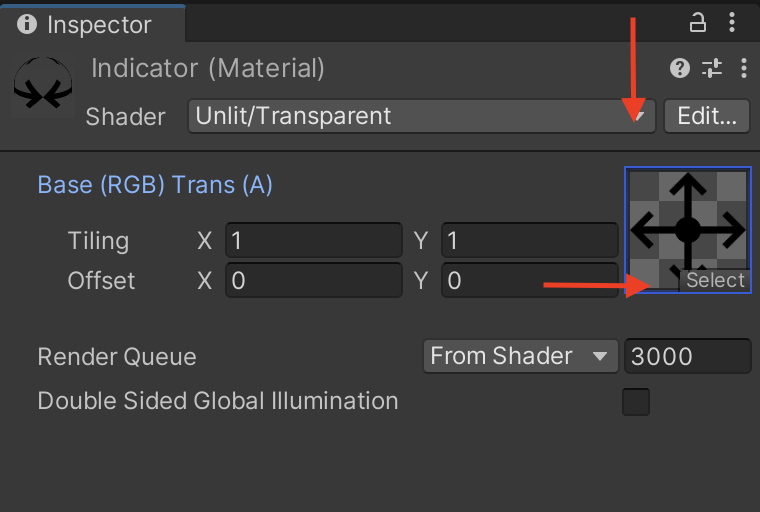

1. Select the **Target** object on the **Hierarchy** window, and look at the **Inspector Window**. Under the **Mesh Renderer** tab, click on **Materials** and drag the **Indicator** material we just created into it.

    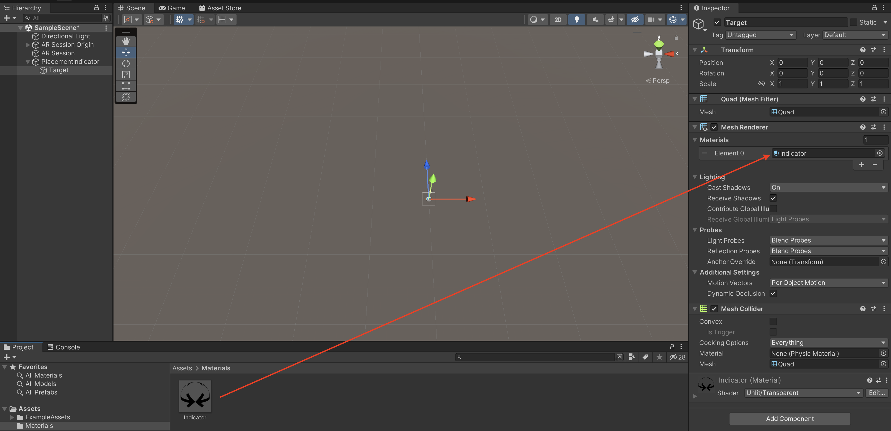

1. Lastly, change the **Target** object's **Rotation** to **90, 0 , 0** under **Transform** in the **Inspector Window**.

### Create the Object Placement Script

1. This script will enable the user to scan their surroundings and then place an object at the placement indicator's location.  To create a new script, in the **Project** window, right click into the **Scripts** folder and select **Create > C# Script**. Name the script **ObjectPlacement** and double click to compile and open in Visual Studio.

1. In Visual Studio, add the following script:

    ```csharp

    using System.Collections;
    using System.Collections.Generic;
    using UnityEngine;
    using UnityEngine.XR.ARFoundation;
    using UnityEngine.XR.ARSubsystems;

    public class ObjectPlacement : MonoBehaviour
    {
        //Declaring the Objects that will be placed (Basketball, Basketball Hoop and Indicator)
        public GameObject Hoop;
        public GameObject Ball;
        public GameObject placementIndicator;
        //Spawned Object serves as a mediator to determine whether the object has been placed or not.
        private GameObject spawnedObject;
        //Pose Object that will allow us to validate the indicator's position
        private Pose PlacementPose;
        //an AR Raycast Manager to give us access to Raycasting (used in placing objects via indicator)
        private ARRaycastManager arRaycastManager;
        //Initial pose is set to false so that we can validate it later.
        private bool placementPoseIsValid = false;
        private bool isHoopPlaced = false;

        
        void Start()
        {
            //This calls for the AR Raycast Manager to be instantiated as the application starts.
            arRaycastManager = FindObjectOfType<ARRaycastManager>();
        }

        void Update()
        {
            //Check if there is any spawnedObjects, that the placement location is valid, and that the user has touched the screen to place an object.
            if(spawnedObject == null && placementPoseIsValid && Input.touchCount > 0 && Input.GetTouch(0).phase == TouchPhase.Began)
            {
                //Places the Hoop
                ARPlaceObject();
                
                isHoopPlaced = true;

                //Check if the Hoop has been placed before showing the ball
                if(isHoopPlaced)
                {
                    //Spawns the ball
                    spawnedObject = Instantiate(Ball);
                    //Sets the ball's position to the camera's (the user Point of View) position.
                    spawnedObject.transform.parent = arRaycastManager.transform.Find("AR Camera").gameObject.transform;
                }
            }

            //Continuously updates the location of the indicator and the pose's values until the object is placed.
            UpdatePlacementPose();
            UpdatePlacementIndicator();
        }

        //This method allows the user to move the placement indicator based on the Pose's position
        void UpdatePlacementIndicator()
        {
            //Checks that no objects are spawned and that the placement pose is currently valid
            if(spawnedObject == null && placementPoseIsValid)
            {
                //Spawns the indicator and updates it according to the PlacementPose position and rotation.
                placementIndicator.SetActive(true);
                placementIndicator.transform.SetPositionAndRotation(PlacementPose.position, PlacementPose.rotation);
            }
            else
            {
                //Once the object is placed, the indicator is despawned.
                placementIndicator.SetActive(false);
            }
        }
        //This method updates the placement pose based on Ray casting.
        void UpdatePlacementPose()
        {
            //Defines the screen's center
            var screenCenter = Camera.current.ViewportToScreenPoint(new Vector3(0.5f, 0.5f));
            //Stores the ray cast' hits as the user moves the camera around.
            var hits = new List<ARRaycastHit>();
            arRaycastManager.Raycast(screenCenter, hits, TrackableType.Planes);
            //Validates based on whether there are hits or not.
            placementPoseIsValid = hits.Count > 0;
            if(placementPoseIsValid)
            {
                PlacementPose = hits[0].pose;
            }
        }
        //This method allows for the Hoop object to be placed.
        void ARPlaceObject()
        {
            spawnedObject = Instantiate(Hoop, PlacementPose.position, PlacementPose.rotation);
        }
    }   
    ```
1. Now we add the script as a component to the **AR Session Origin** object. In the **Hierarchy** window, select the **AR Session Origin** object, then at the **Inspector** window, click on **Add Component**. Search for **ObjectPlacement** and select it.

### Create the Ball Manipulation Script.

1. This script will allow the user to throw the ball, as well as dictating the ball's behavior from the throw.  To create a new script, in the **Project** window, right click into the **Scripts** folder and select **Create > C# Script**. Name the script **BallManipulation** and double click to compile and open in Visual Studio.

1. In Visual Studio, add the following Script:

    ```csharp
    /**
    This code is adapted from github user tudorelu's ar-free-throw application. To check the original you can visit his repository at https://github.com/tudorelu/ar-free-throw

    **/

    using System.Collections;
    using System.Collections.Generic;
    using UnityEngine;
    using UnityEngine.XR.ARFoundation;

    //This will assign a Rigidbody component (necessary for physics) to the object we attach this script to.
    [RequireComponent(typeof(Rigidbody))]
    public class BallManipulation : MonoBehaviour
    {
        //This defines the force at which the ball will be thrown. Feel free to change it and see how it affects the behavior!
        public float throwForce = 75f;

        // X and Y axis damping factors for the throw direction and the offset of the ball's position in relation to camera's position. These values can be modified if needed, as it will depend on how you wish the throw to feel.
        public float throwDirectionX = 0.17f;
        public float throwDirectionY = 0.67f;
        public Vector3 ballCamOffset = new Vector3(0f, -1.4f, 3f);

        //Declare the start and direction vectors
        private Vector3 startPosition;
        private Vector3 direction;
        //Declare the time and duration values.
        private float startTime;
        private float endTime;
        private float duration;
        //Declare the conditions of direction and throw.
        private bool directionChosen = false;
        private bool throwStarted = false;

        [SerializeField]
        GameObject ARCam;

        [SerializeField]
        ARSessionOrigin sessionOrigin;

        Rigidbody rbody;

        private void Start()
        {
            //At the start of application, ensure that we have access to the Rigidbody component,
            //the AR Session, the AR Camera and that the ball is at the start position.
            rbody = gameObject.GetComponent<Rigidbody>();
            sessionOrigin = GameObject.Find("AR Session Origin").GetComponent<ARSessionOrigin>();
            ARCam = sessionOrigin.transform.Find("AR Camera").gameObject;
            transform.parent = ARCam.transform;
            ResetBall();
        }

        private void Update()
        {

            //When the screen is touched, gather information about the throw
            if (Input.GetMouseButtonDown(0))
            { //This method works for both mouse and touch when used in mobile.
                startPosition = Input.mousePosition;
                startTime = Time.time;
                throwStarted = true;
                directionChosen = false;
            }
            //Once the touch is done, we stop gathering information about the throw and define the chosen direction
            else if (Input.GetMouseButtonUp(0))
            {
                endTime = Time.time;
                duration = endTime - startTime;
                direction = Input.mousePosition - startPosition;
                directionChosen = true;
            }

            //Checks if direction is chosen, which then releases the ball
            if (directionChosen)
            {
                rbody.mass = 1;
                rbody.useGravity = true;

                rbody.AddForce(
                    ARCam.transform.forward * m_ThrowForce / duration +
                    ARCam.transform.up * direction.y * throwDirectionY +
                    ARCam.transform.right * direction.x * throwDirectionX);

                startTime = 0.0f;
                duration = 0.0f;

                startPosition = new Vector3(0, 0, 0);
                direction = new Vector3(0, 0, 0);

                throwStarted = false;
                directionChosen = false;
            }

            //After a set amount of time, in this case 4 seconds, we reset the ball to the starting position (in front of the camera)
            if (Time.time - endTime >= 3 && Time.time - endTime <= 5)
                ResetBall();

        }
        //This method allows the ball to come back to the user's "hands"
        public void ResetBall()
        {
            //Resets the values of mass, velocity, angular velocity and turns the gravity off the ball object.
            rbody.mass = 0;
            rbody.useGravity = false;
            rbody.velocity = Vector3.zero;
            rbody.angularVelocity = Vector3.zero;
            endTime = 0.0f;
            //Changes the ball's position to the camera's position.
            Vector3 ballPos = ARCam.transform.position + ARCam.transform.forward * ballCamOffset.z + ARCam.transform.up * ballCamOffset.y;
            transform.position = ballPos;
        }

    }

1. We will add this script to the Ball Prefab that we will create in the upcoming step.

### Create the Hoop and Basketball Prefabs

1. We will be using the Basketball Hoop and Basketball Models we used back in [Unit 6's Activity](../6-unity-fundamentals/assignment.md).

1. To start with the *Basketball Hoop*, navigate to the **Create a Basketball Hoop** section and follow up to step 3, where we drag the model into the scene and disable the **Camera** GameObject that comes with it. If you completed the activity, you can skip this step and just drag the model from the Activity's Project to this new Project.

1. The **basketball-hoop** needs to be resized to fit the scale of the application. In the **Inspector** window, modify the **basketball-hoop Transform Scale** to **0.2, 0.2, 0.2**.

    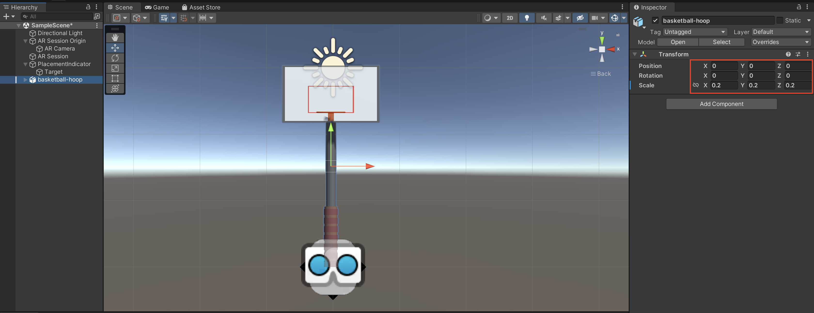

1. To ensure the ball can collide with the hoop, we will add a **Mesh Collider** to the Hoop's model. In the **Inspector Window**, click on **Add Component**. Search and select **Mesh Collider**, and check the **Convex** box.

    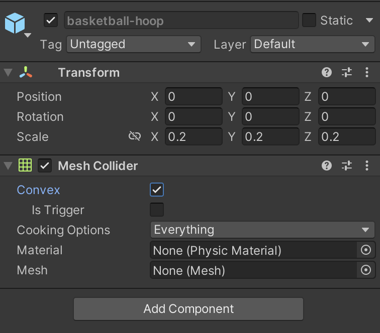

1. We will create a Prefab from this model, so that we can delete the GameObject from the **Hierarchy Window** yet still use it in our scripts. To create a Prefab, drag the **resized model** from the **Project Window** into the Prefabs Folder, and select **Create Original Prefab**. Delete the basketball-hoop model from the **Hierarchy Window**.

1. To create the *Basketball*, go back to [Unit 6's Activity](../6-unity-fundamentals/assignment.md) and search for the **create a Basketball** section. Follow up to step 2, or drag the model from the Activity's Unity project.

1. Drag the **basketball** model into the scene, and resize it by modifying the **Transform Scale** in the **Inspector Window** to **.015, .015, .015**.

1. We will add two components to the ball model before we convert it to prefab. The first one will be the Ball Manipulation Script. In the **Inspector Window**, click on **Add Component** and search for the **Ball Manipulation Script**. Once added, you will notice that a **Rigidbody** component is added as well.

1. The next component we will add is a Sphere Collider. Click on **Add Component** in the **Inspector Window** and select **Sphere Collider**. Change the **Radius** to **13**.

1. For the Sphere Collider to behave properly, we will need to add a **Physics Material** to the component. Right click the **Materials** folder, and select **Create > Physic Material**. Rename it **Bouncing Ball**.

1. In the **Inspector Window**, change the material's values for **Dynamic Friction** to **0.4**, **Static Friction** to **0.4** and **Bounciness** to **0.5**.

1. Select the **basketball** model and drag the **Bouncing Ball Material** into the **Sphere Collider**'s Material field. 

    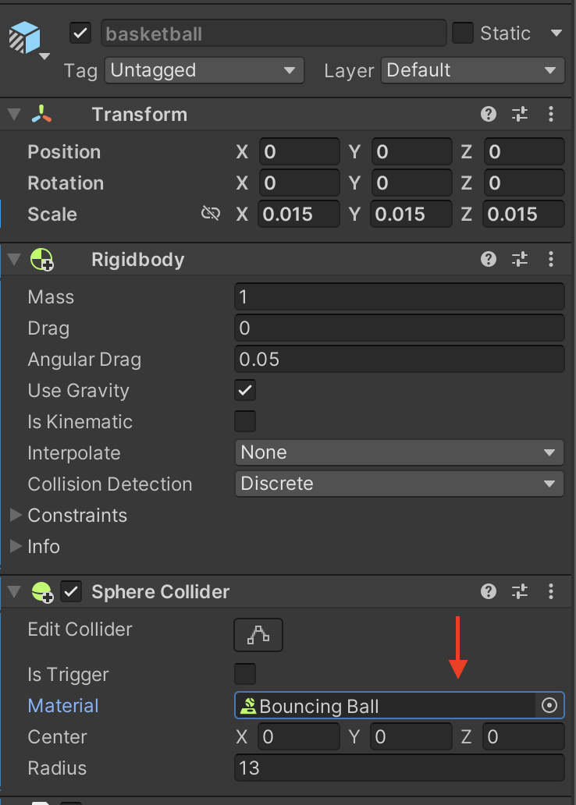

1. Now we can create *basketball* **prefab**. Drag the **basketball** object into the **Prefabs** Folder and select **Create Prefab Variant**. Rename the prefab to **basketball** and delete the **basketball** game object from the **Hierarchy Window**.

### Complete the Object Placement Script

1. Now that the prefabs are created, we can drag them into the **Object Placement Script** fields in our **AR Session Origin** object. Select the **AR Session Origin** object in the hierarchy window, and drag the *basketball hoop prefab* into the **Hoop** field, the *basketball prefab* into the **Ball** field, and the **Placement Indicator** game object from the **Hierarchy Window** into the **Placement Indicator** field.

    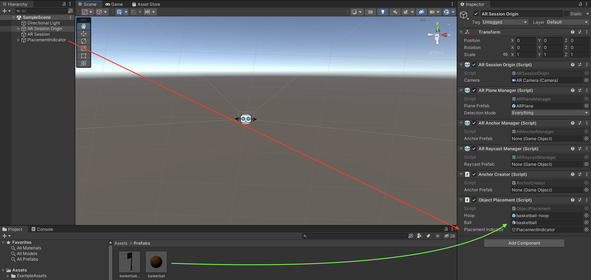

### Build and Deploy

1. The application is now ready to build. Navigate to **File > Build Settings** and click on **Build**. This will prompt you for a location to build the app in. Navigate to **Desktop** and create a new folder named **AR Implementation**. Open it and click **Choose**.

1. Once the Build is complete, the folder will include an **Xcode Project** file (.xcodeproj) that can then be opened in Xcode to deploy.

1. To deploy into an iOS device you are required to have an **Apple ID** linked to Xcode, and to create a Personal team for signing. [Unity's Documentation](https://docs.unity3d.com/Manual/iphone-GettingStarted.html) explains how to set these up.

1. Once your **Apple ID** and personal team is set, click on the **Xcode Project**, navigate to **Signing & Capabilities**, click on **Automatically manage signing** and select your **Personal Team** from the **Team** dropdown menu.

    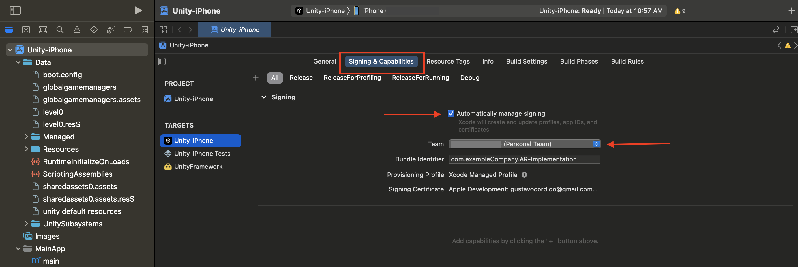

1. Connect a compatible iOS device and click on the **Play Button** to deploy. 

    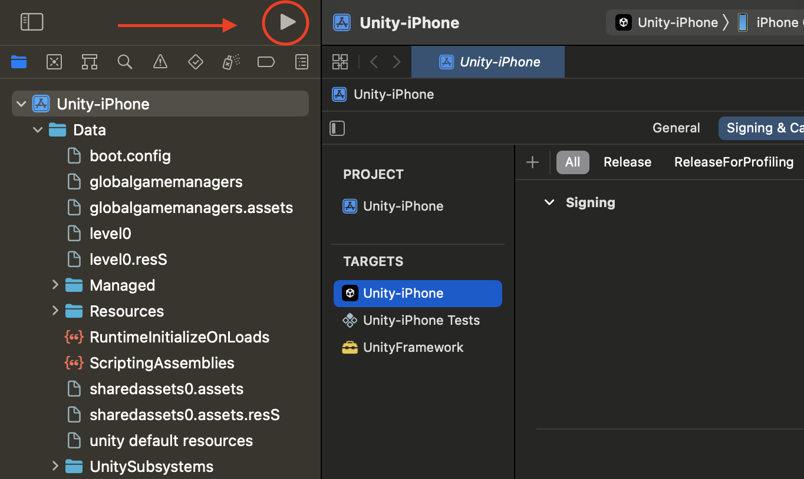

## Run the App

1. You can now run the application on your device and test it out!

    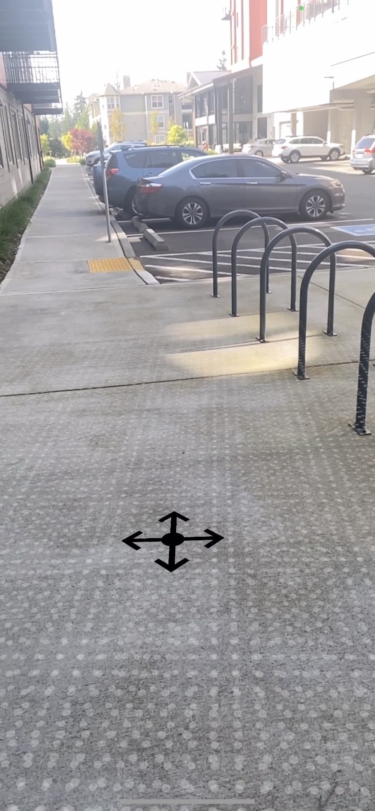

    

    